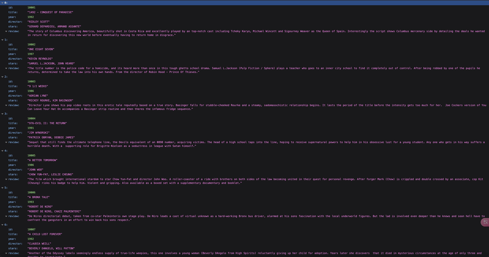
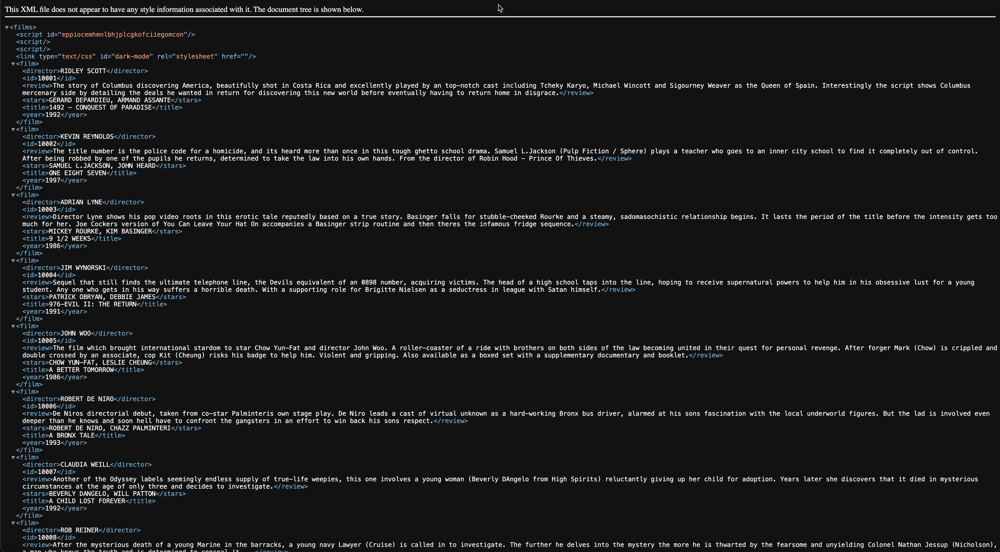
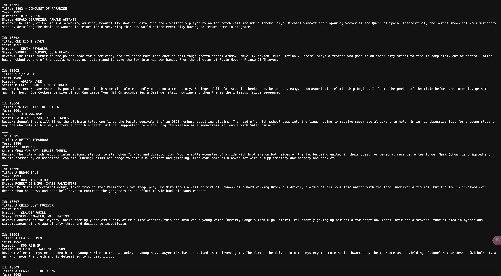

### FilmRestful (RESTful API)

#### JSON Format



#### XML Format



#### TEXT Format



### Project Overview

FilmRestful is a RESTful web application developed using Java Servlets to manage a collection of films. It allows users to perform CRUD (Create, Read, Update, Delete) operations on the film database. It supports search functionality and enhances user experience with different response formats like JSON, XML, and plain text.

### Features

- Add, edit, delete, and list films
- Search films by various criteria
- Support for multiple data formats (JSON, XML, TEXT)
- CORS policy management for cross-origin requests

### Technologies Used

- **Backend:** Java, Servlets
- **Database:** MySQL
- **Libraries:** Gson for JSON conversion, Jakarta XML Bind for XML conversion
- **Build Tool:** Apache Maven
- **IDE:** Eclipse

### Getting Started

#### Prerequisites

- Java Development Kit (JDK) 8 or later
- Apache Maven
- MySQL Server

#### Installation

1. Clone the repository:

   ```bash
   git clone https://github.com/suatkocar/FilmRestful.git
   ```

2. Navigate to the project directory:

   ```bash
   cd FilmRestful
   ```

3. Set up the database:
   
   - Create a MySQL database named filmrestfuldb.
   - Execute the SQL script located at `src/main/resources/createfilms.sql` to create the necessary tables.

4. Create and configure the config.properties file:

   - Copy the example config file:

     ```bash
     cp src/main/resources/config.properties.example src/main/resources/config.properties
     ```

   - Edit the config.properties file and set your database and API credentials:

     ```properties
     jdbcUrl=jdbc:mysql://localhost:3306/filmrestfuldb
     jdbcUser=your-username
     jdbcPassword=your-password
     ```

5. Build the project:

   ```bash
   mvn clean install
   ```

6. Deploy the `FilmRestful.war` file created in the target folder to your servlet container (e.g., Apache Tomcat).

### Usage

Access the application at `http://localhost:8080/FilmRestful`.

### Project Structure

```plaintext
FilmRestful
├── build
├── src
│   ├── main
│   │   ├── java
│   │   │   ├── controllers
│   │   │   │   ├── filters
│   │   │   │   │   └── CorsFilter.java
│   │   │   │   └── rest
│   │   │   │       └── FilmController.java
│   │   │   ├── dao
│   │   │   │   └── FilmDAO.java
│   │   │   ├── listeners
│   │   │   │   └── AppContextListener.java
│   │   │   ├── models
│   │   │   │   ├── Film.java
│   │   │   │   └── Films.java
│   │   │   ├── services
│   │   │   │   └── FilmService.java
│   │   │   └── util
│   │   │       ├── JsonConverter.java
│   │   │       ├── RequestHelper.java
│   │   │       ├── RequestParser.java
│   │   │       ├── ResponseHandler.java
│   │   │       ├── TextConverter.java
│   │   │       ├── XmlConverter.java
│   │   │       └── YamlConverter.java
│   │   └── resources
│   │       ├── config.properties
│   │       ├── config.properties.example
│   │       └── createfilms.sql
│   └── webapp
│       ├── META-INF
│       │   └── MANIFEST.MF
│       ├── WEB-INF
│       │   ├── lib
│       │   └── web.xml
│       └── redirect.jsp
└── README.md
```

### License

This project is licensed under the MIT License - see the [LICENSE.md](LICENSE.md) file for details.

### Contact

For any inquiries, please contact me at suatkocar.dev@gmail.com.